# Git Insights Analyzer

A deep repository analyzer built on the T3 Stack. It provides structural analysis, hotspot detection, and visual insights into your GitHub repositories.

**Repository:** [https://github.com/Its-Satyajit/git-insights-analyzer](https://github.com/Its-Satyajit/git-insights-analyzer)

---

## Features

- **Modern Dashboard**: A high-performance dashboard using TanStack Query and Virtualization for large repo trees.
- **Deep Analysis**:
  - **Dependency Graph**: Understand how files connect using Tree-sitter powered parsing.
  - **Hotspot Detection**: Identify complex areas with high churn/loc/dependency weights.
  - **FileType Distribution**: Visual breakdown of your codebase composition.
- **Virtualized Treemaps**: Navigate entire repositories with D3-powered squarified treemaps.
- **Hybrid File Viewing**: Secure previews for both public and private GitHub files with Shiki syntax highlighting.
- **Async Worker Pipeline**: Industrial-grade analysis queue powered by Inngest.

## Tech Stack

- **Framework**: Next.js (App Router, Server Actions)
- **Styling**: Tailwind CSS, shadcn/ui
- **Database**: PostgreSQL with Drizzle ORM
- **Auth**: Better-Auth
- **Backend Logic**: Elysia (Server Logic), Inngest (Background Jobs)
- **Storage**: S3 API (IDrive E2) for large AST blobs, PostgreSQL for metadata
- **Parsers**: Tree-sitter (via WASM)
- **Visuals**: D3.js, Recharts, Framer Motion

## Architecture & Data Flow

This application is built defensively to prevent database bloating by offloading heavy computational objects (parsed ASTs, dependency graphs) into compressed Blob storage.

```mermaid
sequenceDiagram
    participant User as Client Browser
    participant API as Next.js/Elysia API
    participant PG as PostgreSQL (Drizzle)
    participant Worker as Inngest Worker
    participant S3 as S3 Object Storage (IDrive E2)
    participant GH as GitHub API

    User->>API: Trigger Analysis (/api/analyze)
    API->>PG: Check 24hr Rate Limit
    API->>Worker: Enqueue 'analysis/repo.requested'
    API-->>User: Return Job Status

    rect rgb(20, 50, 20)
    Note over Worker: Background Processing Phase
    Worker->>GH: Shallow Clone Repository (--depth 1)
    Worker->>Worker: Local FS Read (by-pass rate limits)
    Worker->>Worker: Tree-Sitter AST Parsing
    Worker->>GH: Fetch Commit Churn (History)
    Worker->>Worker: Hotspot Detection (Churn + Depth + LoC)
    Worker->>Worker: MessagePack & Brotli Compression
    Worker->>S3: Upload Compiled Insight Blobs
    Worker->>PG: Save Meta (Contributors, Sync Status, S3 Key)
    end

    User->>API: Load Dashboard (polls /api/status)
    API->>S3: Stream AST & Dependencies Blob
    API-->>User: Render Virtualized D3 Treemaps
```



### Step-by-Step Data Flow

1. **API Trigger**: The Next.js client hits the Elysia API (`/api/analyze`), which validates the request and enqueues an asynchronous Inngest event.
2. **Rate Limiting Guard**: The application checks PostgreSQL to ensure the repository wasn't analyzed within the last 24 hours, saving compute resources.
3. **Repository Acquisition**: Instead of pure REST API calls which exhaust GitHub rate limits, the worker executes a **Shallow Git Clone** directly to the local filesystem (`.tmp/[repoId]`).
4. **AST Generation**: Source code files are read locally and parsed by **Tree-sitter WASM modules** to extract deep structural Syntax Trees (detecting functions, imports, dependencies).
5. **Logic Analysis**: 
   - Uses GitHub's Commit history to count exact line-churn per file.
   - Computes **Hotspot scores** mathematically derived from AST dependency edge weights, commit churn, and Lines of Code.
6. **Binary Compression**: The resulting dependency graphs and tree AST JSON are massive. They are efficiently shrunk using **MessagePack** and **Brotli interning**.
7. **Cold Storage Write**: Bypassing relational database bloat, these compressed byte-blobs are uploaded to an **S3 Bucket (IDrive E2)**. Only lightweight relational metadata (e.g. Total Files, Status, Contributors) and the unique `s3StorageKey` are synced to **PostgreSQL**.
8. **Client Rendering**: Upon completion, the dashboard fetches the file tree from S3 and renders it inside highly optimized `@tanstack/react-virtual` DOM components alongside D3.js.

## Getting Started

### 1. Prerequisites

- Node.js (Latest LTS)
- pnpm
- PostgreSQL
- S3 Compatible Object Storage (e.g., IDrive E2)

### 2. Environment Setup

Copy .env.example to .env and fill in your credentials:

```bash
cp .env.example .env
```

Key required variables:
- GITHUB_TOKEN: A Personal Access Token for GitHub API access.
- DATABASE_URL: Your PostgreSQL connection string.
- S3 API Keys: Your access keys for object storage.
- INNGEST_EVENT_KEY: Your specific event key from Inngest.

### 3. Installation

```bash
pnpm install
```

### 4. Running the App

```bash
pnpm dev
```

The app will be available at http://localhost:3000.

## License

Distributed under the MIT License. See LICENSE for more information.

---

Built for the open-source community by Satyajit.
